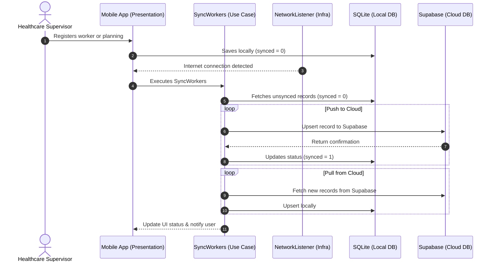

# 📱 FaciTurno - Medical Shift & Personnel Organizer

**FaciTurno** is an **Offline-First** mobile application built with **React Native (Expo SDK 57)** and **TypeScript**, designed for hospital departments and healthcare facilities to manage medical personnel, shift planning, hospital rooms/beds, and automated cloud synchronization.

The project is structured under **Hexagonal Architecture (Ports & Adapters)**, ensuring the business logic remains fully decoupled from the presentation layer, local storage (SQLite), cloud providers (Supabase), and external libraries.

---

## ✨ Features

- **📅 Shift & Schedule Planning**: Assign personnel to customizable departments, rooms, and shift schedules.
- **👤 Personnel Management**: Register and manage workers with offline local storage and instant search.
- **🛏️ Rooms & Beds Management (Salas)**: Dedicated room management with bed capacity, department grouping, status tracking (*Available*, *Occupied*, *Maintenance*), and notes.
- **☁️ Offline-First & Cloud Sync**: Seamless local operations using SQLite with automatic and manual synchronization to Supabase.
- **🧭 Animated Tab Navigation**: Gorhom-style fluid bubble tab bar with Material icons and safe area support.
- **⚙️ Dynamic App Configuration**: Manage departments, shifts, and app settings directly within the app without code modifications.

---

## 🚀 Getting Started

### 1. Prerequisites

- **Node.js**: v18 or later
- **npm** or **yarn**
- **Expo Go** app installed on your physical mobile device (iOS or Android), or an emulator/simulator.
- A free **[Supabase](https://supabase.com)** account (for cloud backup & synchronization).

### 2. Clone and Install Dependencies

```bash
# Clone repository
git clone https://github.com/your-username/faciturno.git
cd faciturno

# Install dependencies
npm install
```

---

## 🗄️ Supabase Cloud Setup Guide (Important)

> [!IMPORTANT]
> While local data (SQLite) is automatically initialized on the device, **Supabase PostgreSQL tables must be created manually once in your Supabase project**.

Follow these simple steps to configure your Supabase backend:

### Step 1: Create a Supabase Project
1. Log in to [supabase.com](https://supabase.com) and click **"New Project"**.
2. Give your project a name and choose a secure database password.

### Step 2: Run the SQL Setup Script
1. Navigate to the **SQL Editor** tab in your Supabase project dashboard.
2. Click **"New Query"**, paste the following SQL script, and click **"Run"**:

```sql
-- 1. Create the workers table
CREATE TABLE IF NOT EXISTS public.workers (
  id BIGINT GENERATED BY DEFAULT AS IDENTITY PRIMARY KEY,
  full_name TEXT NOT NULL,
  position TEXT NOT NULL,
  created_at TIMESTAMPTZ DEFAULT TIMEZONE('utc', NOW()) NOT NULL
);

-- 2. Enable Row Level Security (RLS)
ALTER TABLE public.workers ENABLE ROW LEVEL SECURITY;

-- 3. Allow anonymous public read/write access via your anon key
CREATE POLICY "Allow public full access to workers" 
ON public.workers 
FOR ALL 
TO anon 
USING (true) 
WITH CHECK (true);
```

### Step 3: Configure Environment Variables
1. Copy the example environment file:
   ```bash
   cp .env.example .env
   ```
2. In your Supabase dashboard, go to **Project Settings ➡️ API** and copy your **Project URL** and **`anon` `public` key**.
3. Edit your `.env` file:
   ```env
   EXPO_PUBLIC_SUPABASE_URL=https://your-project-id.supabase.co
   EXPO_PUBLIC_SUPABASE_ANON_KEY=your-anon-key-here
   ```

---

## 🏃 Running the Application

```bash
# Start Expo development server
npm start
# or: npx expo start

# Run directly on Android
npx expo start --android

# Run directly on iOS (macOS required)
npx expo start --ios
```

Once running, scan the displayed QR code with the **Expo Go** app on your phone.

---

## 🏛️ Hexagonal Architecture

The architecture isolates the core domain from frameworks and UI:

```
   ┌─────────────────────────────────────────────────────────┐
   │                  PRESENTATION LAYER                     │
   │           (React Native Screens, Hooks, UI)             │
   │                                                         │
   │   ┌─────────────────────────────────────────────────┐   │
   │   │              APPLICATION LAYER                  │   │
   │   │             (Use Cases / Interactors)           │   │
   │   │                                                 │   │
   │   │   ┌─────────────────────────────────────────┐   │   │
   │   │   │              DOMAIN LAYER               │   │   │
   │   │   │        (Entities, Ports & Rules)        │   │   │
   │   │   │                                         │   │   │
   │   │   └─────────────────────────────────────────┘   │   │
   │   │                        ▲                        │   │
   │   └────────────────────────┼────────────────────────┘   │
   │                            │                            │
   │   ┌────────────────────────┴────────────────────────┐   │
   │   │             INFRASTRUCTURE LAYER                │   │
   │   │    (SQLite, Supabase, ViewShot, Network, etc.)  │   │
   │   └─────────────────────────────────────────────────┘   │
   └─────────────────────────────────────────────────────────┘
```

### 📂 Directory Structure

```text
src/
├── domain/                      # 🧠 DOMAIN: Pure business models & contracts
│   ├── entities/                # Core domain entities (Worker, etc.)
│   ├── constants/               # Centralized configuration (appConfig.ts)
│   └── ports/                   # Interfaces / Ports (WorkerRepository, ConfigRepository, SyncService)
│
├── application/                 # ⚙️ APPLICATION: Use Cases
│   └── use-cases/               # AddWorker, GetWorkers, SyncWorkers, etc.
│
├── infrastructure/              # 🔌 INFRASTRUCTURE: External Adapters
│   ├── adapters/                # SQLiteWorkerRepository, SQLiteConfigRepository, SupabaseSyncService
│   ├── config/                  # Supabase client setup
│   └── network/                 # Network connectivity listener
│
├── presentation/                # 🎨 PRESENTATION: User Interface
│   ├── components/              # Reusable UI components (AnimatedTabBar)
│   └── screens/                 # HomeScreen, PlanningScreen, WorkersScreen, RoomsScreen, SettingsScreen
│
└── container.ts                 # 🪢 DEPENDENCY INJECTION: Connects adapters with use cases
```

---

## 🔄 Offline-First Synchronization Workflow



---

## 🧪 Type Checking & Quality

To verify TypeScript types across the entire project:

```bash
npx tsc --noEmit
```

---

## 📄 License

This project is licensed under the MIT License - see the [LICENSE](file:///home/luismonasterios/Escritorio/PROYECTOS/IVSS-WORKERS-ORGANIZER/LICENSE) file for details.
