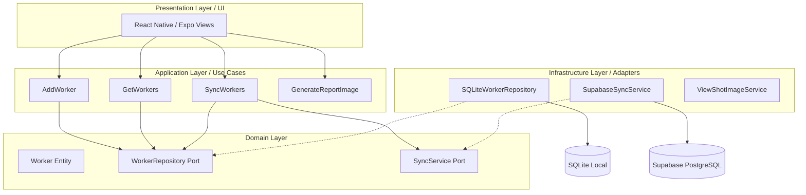
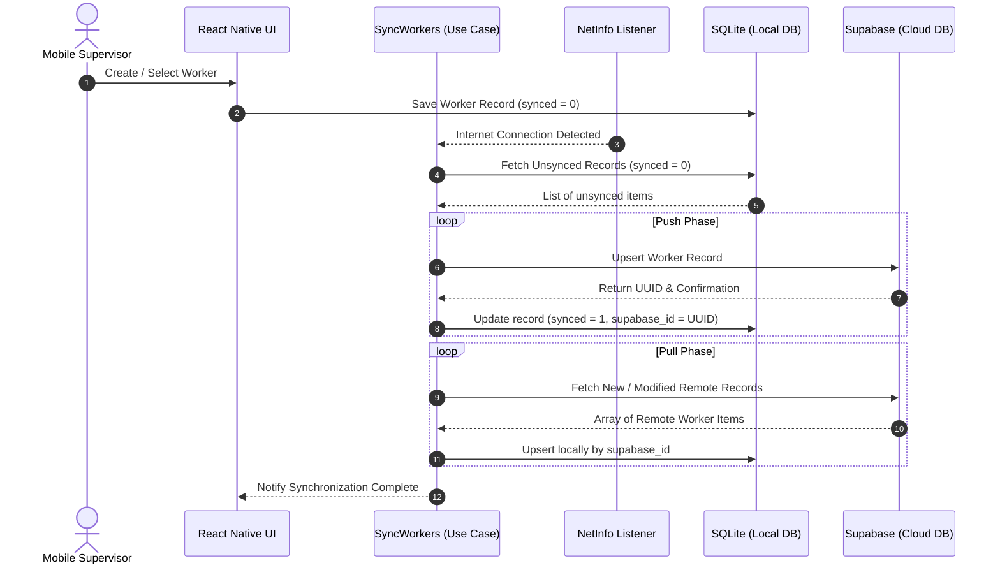
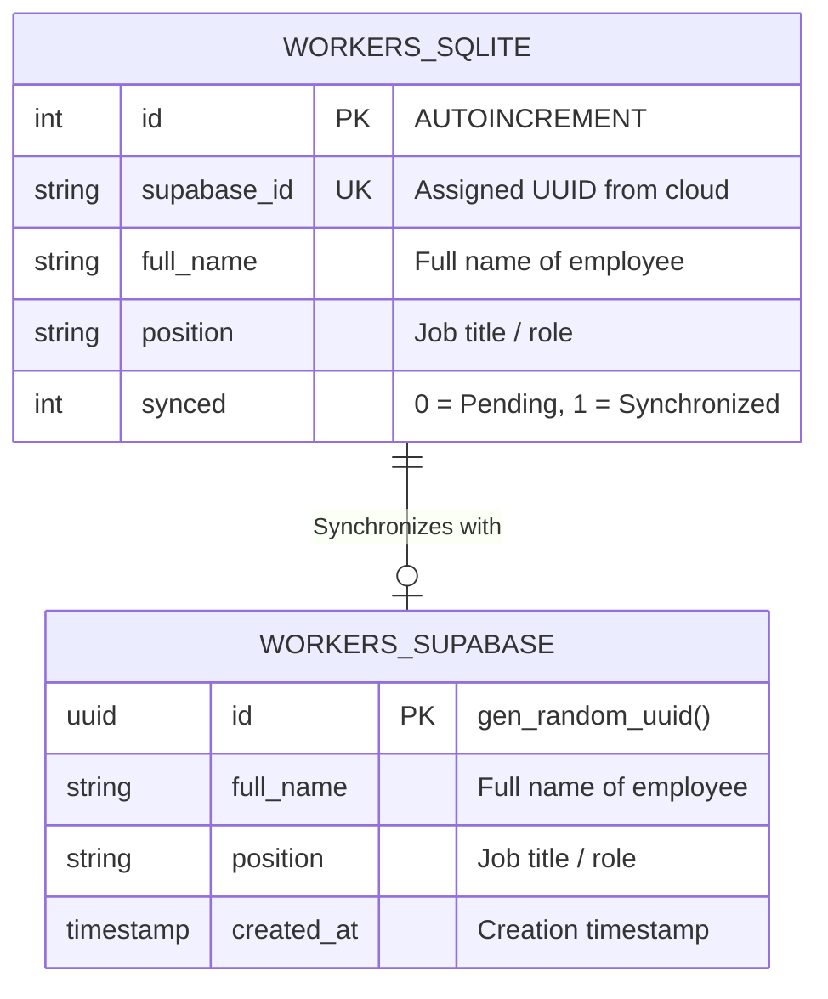
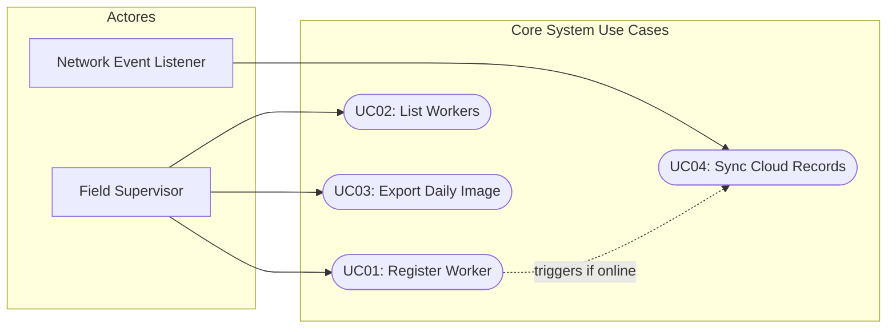

# Daily Worker Report & Sync Engine (Mobile)

An **Offline-First** React Native application engineered for rapid daily activity logging, dynamic worker data capture, and automated report image generation. Built with a robust **Hexagonal Architecture (Ports & Adapters)**, it ensures seamless operational continuity without network connectivity while maintaining asynchronous, bidirectional synchronization with Supabase.

---

## 🎯 Purpose of the Software

The primary objective of this application is to streamline and formalize daily workforce reporting directly from the field. It provides a lightweight, resilient mobile tool that empowers site supervisors and administrators to:
1. Capture daily labor hours, task progress, and shift summaries instantly.
2. Maintain a clean, locally accessible repository of workers and job titles.
3. Export standardized, visual proof-of-work images for immediate sharing via messaging channels (e.g., WhatsApp, Email) without requiring back-office processing.

---

## 💡 Key Problems Solved

* **Network Dependency in Remote Environments:** Operational sites often suffer from spotty or zero cellular coverage. The app prioritizes local database operations (**SQLite**), eliminating app freezes or data loss when offline.
* **Complex/Slow Reporting Workflows:** Replaces paper forms and cumbersome spreadsheet entries with a 30-second mobile entry flow that exports direct visual receipts.
* **Data Discrepancies Across Devices:** Automatically handles background **Push/Pull synchronization** once connection is restored, keeping central cloud records (**Supabase**) aligned with local device states.
* **Vendor Lock-in & Tight Coupling:** Leverages Hexagonal Architecture, isolating core business rules from external services. Swapping out database engines (e.g., SQLite to WatermelonDB) or cloud providers (e.g., Supabase to AWS DynamoDB) requires zero changes to core domain logic.

---

## 🛠️ Tech Stack & Key Tools

| Category | Technology | Description |
| :--- | :--- | :--- |
| **Framework** | **React Native (Expo)** | Cross-platform mobile runtime. |
| **Architecture** | **Hexagonal (Ports & Adapters)** | Decouples core use cases from external drivers/driven adapters. |
| **Local Storage** | **`expo-sqlite`** | Embedded relational engine for offline-first persistence. |
| **Cloud Backend** | **Supabase (`@supabase/supabase-js`)** | PostgreSQL cloud persistence and synchronization endpoint. |
| **Network State** | **`@react-native-community/netinfo`** | Event-driven connection listener to trigger sync jobs. |
| **Image Generation** | **`react-native-view-shot`** | Rasterizes native UI layout components into high-res PNG images. |
| **Native Sharing** | **`expo-sharing`** | Invokes OS-native share sheets for generated media delivery. |

---

## 🏛️ Hexagonal Architecture (Ports & Adapters)

The codebase strictly isolates domain entities and application use cases from framework-specific code and external infrastructure adapters.



---

## 🔄 Synchronization Flow Diagram

Asynchronous, bidirectional reconciliation triggered automatically upon network connectivity status changes.



---

## 🗄️ Database Schema & Data Models

Relational mapping bridging local SQLite embedded persistence with cloud-hosted PostgreSQL on Supabase.



### Local DDL (SQLite)

```sql
CREATE TABLE IF NOT EXISTS workers (
  id INTEGER PRIMARY KEY AUTOINCREMENT,
  supabase_id TEXT UNIQUE,
  full_name TEXT NOT NULL,
  position TEXT NOT NULL,
  synced INTEGER DEFAULT 0
);

```

### Remote DDL (Supabase PostgreSQL)

```sql
CREATE TABLE public.workers (
  id UUID DEFAULT gen_random_uuid() PRIMARY KEY,
  full_name TEXT NOT NULL,
  position TEXT NOT NULL,
  created_at TIMESTAMPTZ DEFAULT now() NOT NULL
);

```

---

## 📋 System Use Cases



1. **UC01 - Register Worker:** Captures worker details locally with an initial state of `synced = 0`.
2. **UC02 - List Workers:** Queries SQLite locally to provide zero-latency population of UI dropdowns and pickers.
3. **UC03 - Export Daily Image:** Renders a structured visual preview containing date, worker information, and logged shift hours into a PNG asset ready for sharing.
4. **UC04 - Sync Cloud Records:** Background reconciliation job that pushes local additions and pulls remote additions via Supabase endpoints.

---

## 🚀 Getting Started

### Prerequisites

* Node.js (v18+)
* Expo CLI (`npx expo`)
* Expo Go app on device or an Android/iOS emulator

### Installation

```bash
# Clone the repository
git clone <repository-url>
cd daily-report-app

# Install dependencies
npm install

# Install required Expo native modules
npx expo install expo-sqlite @supabase/supabase-js @react-native-community/netinfo react-native-view-shot expo-sharing

# Start local development server
npx expo start

```
