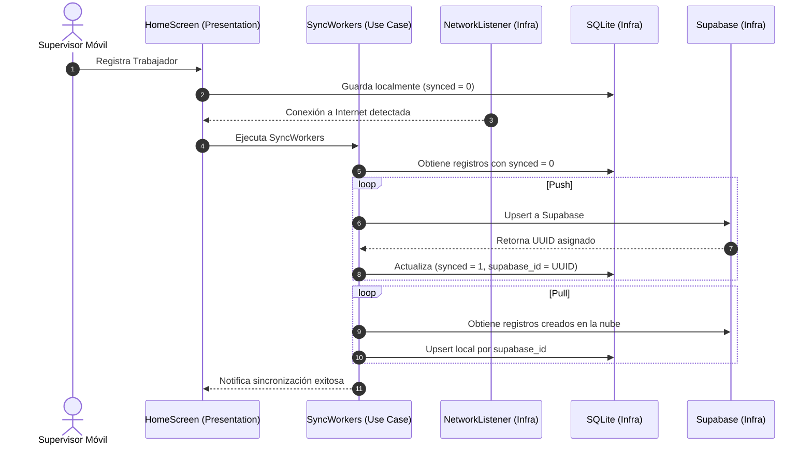

# 📱 Daily Worker Report & Sync Engine (Mobile)

Aplicación móvil **Offline-First** construida con **React Native (Expo)** y TypeScript, diseñada para el registro rápido de actividades diarias de trabajadores, captura de datos y generación/exportación de reportes en imagen.

El proyecto está estructurado bajo **Arquitectura Hexagonal (Ports & Adapters)**, garantizando que la lógica de negocio esté completamente desacoplada de la interfaz de usuario, bases de datos (SQLite/Supabase) y librerías externas.

---

## 🏛️ Guía de Arquitectura Hexagonal: ¿Cómo funciona y dónde va cada cosa?

La Arquitectura Hexagonal divide el sistema en capas concéntricas con una **Regla de Dependencia estricta**: *Las capas internas no saben nada de las capas externas*.

```
   ┌─────────────────────────────────────────────────────────┐
   │                  PRESENTATION LAYER                     │
   │           (React Native, Pantallas, Hooks, UI)           │
   │                                                         │
   │   ┌─────────────────────────────────────────────────┐   │
   │   │              APPLICATION LAYER                  │   │
   │   │             (Casos de Uso / Use Cases)          │   │
   │   │                                                 │   │
   │   │   ┌─────────────────────────────────────────┐   │   │
   │   │   │              DOMAIN LAYER               │   │   │
   │   │   │      (Entidades, Tipos y Puertos)       │   │   │
   │   │   │                                         │   │   │
   │   │   └─────────────────────────────────────────┘   │   │
   │   │                        ▲                        │   │
   │   └────────────────────────┼────────────────────────┘   │
   │                            │                            │
   │   ┌────────────────────────┴────────────────────────┐   │
   │   │             INFRASTRUCTURE LAYER                │   │
   │   │    (SQLite, Supabase, ViewShot, NetInfo, etc.)  │   │
   │   └─────────────────────────────────────────────────┘   │
   └─────────────────────────────────────────────────────────┘
```

---

## 📂 Estructura del Proyecto

```text
src/
├── domain/                      # 🧠 NÚCLEO: Reglas puras del negocio
│   ├── entities/                # Modelos y tipos de datos del dominio
│   │   ├── Worker.ts
│   │   └── index.ts
│   └── ports/                   # Contratos / Interfaces (qué se necesita, sin importar cómo se hace)
│       ├── WorkerRepository.ts
│       ├── SyncService.ts
│       ├── ImageService.ts
│       ├── ShareService.ts
│       └── index.ts
│
├── application/                 # ⚙️ ORQUESTACIÓN: Casos de uso
│   └── use-cases/               # Qué puede hacer la aplicación
│       ├── AddWorker.ts
│       ├── GetWorkers.ts
│       ├── SyncWorkers.ts
│       ├── GenerateReportImage.ts
│       └── index.ts
│
├── infrastructure/              # 🔌 ADAPTADORES: Implementaciones técnicas y librerías
│   ├── adapters/                # Implementación real de los Puertos
│   │   ├── SQLiteWorkerRepository.ts  # Implementa WorkerRepository
│   │   ├── SupabaseSyncService.ts     # Implementa SyncService
│   │   ├── ViewShotImageService.ts    # Implementa ImageService
│   │   ├── ExpoShareService.ts        # Implementa ShareService
│   │   └── index.ts
│   ├── config/                  # Configuración de clientes (Supabase, etc.)
│   │   └── supabase.ts
│   └── network/                 # Utilidades de hardware/red
│       └── NetworkListener.ts
│
├── presentation/                # 🎨 INTERFAZ: Lo que ve e interactúa el usuario
│   ├── components/              # Componentes visuales reutilizables
│   └── screens/                 # Pantallas de la app
│       └── HomeScreen.tsx
│
└── container.ts                 # 🪢 INYECCIÓN DE DEPENDENCIAS (Conecta adaptadores con casos de uso)
```

---

## 🧭 ¿Dónde debo poner tal o cual cosa? (Guía Rápida)

Usa esta tabla de referencia rápida para saber exactamente en qué carpeta crear o modificar archivos:

| Si quieres agregar o modificar... | Carpeta destino | ¿Qué debes hacer? | Ejemplo |
| :--- | :--- | :--- | :--- |
| **Un nuevo modelo de datos del negocio** | `src/domain/entities/` | Crea una interfaz/tipo TypeScript puro (sin React, sin SQLite). | `Task.ts`, `Report.ts` |
| **Un nuevo contrato de servicio o repositorio** | `src/domain/ports/` | Define una `interface` con los métodos que el caso de uso necesitará. | `TaskRepository.ts`, `AuthService.ts` |
| **Una nueva acción/lógica de negocio** | `src/application/use-cases/` | Crea una clase que reciba los puertos en su constructor y exponga un método `execute()`. | `CreateTask.ts`, `DeleteWorker.ts` |
| **Una nueva base de datos o conexión a API** | `src/infrastructure/adapters/` | Implementa la interfaz del puerto (`implements MiPuerto`) usando librerías concretas. | `SQLiteTaskRepository.ts`, `FirebaseSyncService.ts` |
| **Conectar adaptadores con casos de uso** | `src/container.ts` | Instancia el adaptador y pásaselo al caso de uso correspondiente. | `export const container = { ... }` |
| **Una nueva pantalla o vista visual** | `src/presentation/screens/` | Crea el componente React Native y llama a los casos de uso importando `container`. | `WorkerDetailsScreen.tsx` |
| **Un botón, tarjeta o elemento visual reusable** | `src/presentation/components/` | Crea componentes de UI puros con props. | `WorkerCard.tsx`, `SyncBadge.tsx` |

---

## 🚫 Reglas de Oro de las Capas

1. **`src/domain` NUNCA debe importar nada de `infrastructure`, `presentation` ni librerías de React/Expo.**
   - ✅ *Correcto:* `export interface Worker { id: number; full_name: string; }`
   - ❌ *Incorrecto:* `import * as SQLite from 'expo-sqlite'` dentro de `domain/`.

2. **`src/application` solo se comunica con `domain` a través de Puertos (Interfaces).**
   - El caso de uso no sabe si los datos vienen de SQLite, Realm o memoria RAM; solo sabe que el repositorio tiene un método `getWorkers()`.

3. **`src/infrastructure` es la única capa que conoce las librerías externas.**
   - Aquí van `expo-sqlite`, `@supabase/supabase-js`, `react-native-view-shot`, `axios`, etc.

4. **`src/presentation` nunca llama directamente a la base de datos o a Supabase.**
   - La pantalla solo invoca casos de uso a través del `container.ts`.

---

## 🛠️ Tutorial Paso a Paso: ¿Cómo añadir una nueva funcionalidad?

Supongamos que deseas añadir la funcionalidad de **Eliminar un Trabajador**:

### 1. Dominio (Port)
En `src/domain/ports/WorkerRepository.ts`, añade el método al contrato:
```typescript
export interface WorkerRepository {
  // ... métodos existentes
  deleteWorker(id: number): Promise<void>;
}
```

### 2. Aplicación (Caso de Uso)
Crea `src/application/use-cases/DeleteWorker.ts`:
```typescript
import { WorkerRepository } from '../../domain/ports/WorkerRepository';

export class DeleteWorkerUseCase {
  constructor(private readonly workerRepository: WorkerRepository) {}

  async execute(workerId: number): Promise<void> {
    await this.workerRepository.deleteWorker(workerId);
  }
}
```
Expórtalo en `src/application/use-cases/index.ts`.

### 3. Infraestructura (Adaptador)
En `src/infrastructure/adapters/SQLiteWorkerRepository.ts`, implementa la consulta SQL:
```typescript
async deleteWorker(id: number): Promise<void> {
  const db = await this.getDatabase();
  await db.runAsync('DELETE FROM workers WHERE id = ?', [id]);
}
```

### 4. Contenedor de Inyección
En `src/container.ts`, instancia el nuevo caso de uso:
```typescript
import { DeleteWorkerUseCase } from './application/use-cases/DeleteWorker';

const deleteWorkerUseCase = new DeleteWorkerUseCase(workerRepository);

export const container = {
  // ... existentes
  deleteWorkerUseCase,
};
```

### 5. Presentación (UI)
En `src/presentation/screens/HomeScreen.tsx`, usa el caso de uso:
```typescript
const handleDelete = async (id: number) => {
  await container.deleteWorkerUseCase.execute(id);
  await loadWorkers(); // recargar lista local
};
```

---

## 🔄 Flujo Offline-First y Sincronización



---

## ⚙️ Variables de Entorno

Copia el archivo de ejemplo y coloca tus credenciales de Supabase:

```bash
cp .env.example .env
```

Edita `.env`:
```env
EXPO_PUBLIC_SUPABASE_URL=https://tu-proyecto.supabase.co
EXPO_PUBLIC_SUPABASE_ANON_KEY=tu-clave-anon
```

---

## 🚀 Comandos de Desarrollo

```bash
# Instalar dependencias
npm install

# Iniciar servidor de desarrollo Expo
npx expo start

# Ejecutar en Android
npx expo start --android

# Ejecutar en iOS
npx expo start --ios

# Validar tipos TypeScript
npx tsc --noEmit
```
