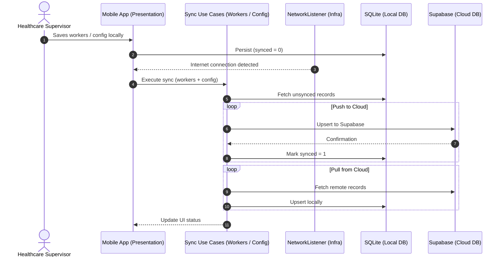

# 📱 FaciTurno — Medical Shift & Personnel Organizer

**FaciTurno** is an **offline-first** mobile application built with **React Native (Expo SDK 57)** and **TypeScript**, designed for hospital departments and healthcare facilities to manage personnel, plan shifts, organize rooms/beds, and back everything up to the cloud automatically.

The codebase follows **Hexagonal Architecture (Ports & Adapters)**: business logic is decoupled from the UI, local storage (SQLite), cloud provider (Supabase), and external libraries.

> Current release: **v1.0.0**

---

## ✨ Features

- **📅 Shift Planning** — Create a plan per **date** (calendar picker), **shift**, and **area/department**, assigning workers to each room.
- **🖼️ Plan Export as Image** — The saved plan renders into a branded template (institute **name + logo**) that you share/export as a PNG with a timestamped filename.
- **🚨 Pending Support Detection** — Rooms without full staff are flagged; external support can be added as *"Se Buscará Apoyo"* (shown in red in the template).
- **👥 Personnel Management** — Register workers with instant search; the add-worker picker includes its own searchable list.
- **🛏️ Rooms & Beds** — Room management with staffing by *total count* or *by position*, status tracking (*Available / Occupied / Maintenance*), department grouping, and notes.
- **⚙️ Dynamic Configuration** — Manage areas/departments and shifts from inside the app.
- **🏥 Hospital Branding** — Set the hospital center name and upload its logo (used in the plan template).
- **🎨 5 Color Themes** — *Default (dark)*, *Matcha Cream*, *Matcha Deep*, *Strawberry Milk*, and *Warm Oatmeal*, persisted on the device.
- **☁️ Offline-First Cloud Sync** — Everything runs on local SQLite; workers **and** configuration (areas, shifts, rooms, settings) sync to Supabase automatically or manually.
- **🧭 Animated Tab Bar** — Fluid bubble tab navigation with safe-area support.

---

## 🚀 Getting Started

### 1. Prerequisites

- **Node.js** v18 or later
- **npm**
- A physical device or emulator for Android / iOS
- A free **[Supabase](https://supabase.com)** account (cloud backup)

> [!IMPORTANT]
> The app uses native modules (`react-native-view-shot`,
> `@react-native-community/datetimepicker`) that are **not** available in
> Expo Go. Build a development client instead (see *Running*).

### 2. Clone and Install

```bash
git clone https://github.com/watchtheblind/IVSS-WORKERS-ORGANIZER.git
cd IVSS-WORKERS-ORGANIZER
npm install
```

---

## 🗄️ Supabase Setup

Local data (SQLite) is initialized automatically; the Supabase tables must be created **once** manually.

1. Create a project at [supabase.com](https://supabase.com).
2. Open **SQL Editor → New Query**, copy the contents of [`supabase/config_sync.sql`](supabase/config_sync.sql), paste, and **Run**.

This creates every table the app needs with public RLS access:

| Table           | Purpose                             |
| --------------- | ----------------------------------- |
| `workers`       | Trabajadores / personnel            |
| `departments`   | Áreas y departamentos               |
| `shifts`        | Turnos y horarios                   |
| `rooms`         | Salas / rooms                       |
| `app_settings`  | Hospital center name, logo flag, theme |

3. Configure environment variables:

```bash
cp .env.example .env
```

Fill your **Project URL** and **`anon` `public` key** (Project Settings → API) in `.env`:

```env
EXPO_PUBLIC_SUPABASE_URL=https://your-project-id.supabase.co
EXPO_PUBLIC_SUPABASE_ANON_KEY=your-anon-key-here
```

---

## 🏃 Running the Application

```bash
# 1. Start the Metro bundler
npm start

# 2. In another terminal, build & run the development client
npm run android        # or: npm run ios (macOS)
```

You can also build a standalone release with **EAS Build**:

```bash
npx eas build --platform android --profile preview
```

---

## 🏛️ Architecture

```
   ┌─────────────────────────────────────────────────────────┐
   │                  PRESENTATION LAYER                     │
   │        (Screens, Components, Theme, AnimatedTabBar)     │
   │                                                         │
   │   ┌─────────────────────────────────────────────────┐   │
   │   │              APPLICATION LAYER                  │   │
   │   │            (Use Cases / Interactors)            │   │
   │   │                                                 │   │
   │   │   ┌─────────────────────────────────────────┐   │   │
   │   │   │              DOMAIN LAYER               │   │   │
   │   │   │        (Entities, Ports & Rules)        │   │   │
   │   │   └─────────────────────────────────────────┘   │   │
   │   │                        ▲                        │   │
   │   └────────────────────────┼────────────────────────┘   │
   │                            │                            │
   │   ┌────────────────────────┴────────────────────────┐   │
   │   │             INFRASTRUCTURE LAYER                │   │
   │   │      (SQLite, Supabase, ViewShot, Network)      │   │
   │   └─────────────────────────────────────────────────┘   │
   └─────────────────────────────────────────────────────────┘
```

### 📂 Directory Structure

```text
src/
├── domain/                      # 🧠 DOMAIN: Pure business models & contracts
│   ├── entities/                # Worker, etc.
│   ├── constants/               # appConfig.ts (defaults)
│   └── ports/                   # WorkerRepository, ConfigRepository, SyncService
│
├── application/                 # ⚙️ APPLICATION: Use Cases
│   └── use-cases/               # AddWorker, GetWorkers, SyncWorkers, SyncConfig,
│                                # GenerateReportImage, ...
│
├── infrastructure/              # 🔌 INFRASTRUCTURE: External Adapters
│   ├── adapters/                # SQLite repositories, SupabaseSyncService,
│   │                            # ViewShotImageService, ExpoShareService
│   ├── config/                  # Supabase client setup
│   └── network/                 # Connectivity listener
│
├── presentation/                # 🎨 PRESENTATION: User Interface
│   ├── components/              # AnimatedTabBar, ShiftTemplate
│   ├── theme/                   # ThemeProvider (5 palettes)
│   └── screens/                 # Home, Planning, Workers, Rooms, Settings
│
└── container.ts                 # 🪢 DI: wires adapters to use cases
```

---

## 🔄 Offline-First Sync Workflow



> [!NOTE]
> Deletes are not propagated between devices (no soft-delete tombstones). The
> hospital **logo** is a local file and is intentionally not uploaded.

---

## 🧪 Type Checking

```bash
npx tsc --noEmit
```

---

## 📦 Releases

- **v1.0.0** — Initial release: shift planning with image export, personnel &
  rooms management, hospital branding, 5 color themes, and offline-first sync
  with Supabase.

---

## 📄 License

MIT — see the [LICENSE](LICENSE) file.